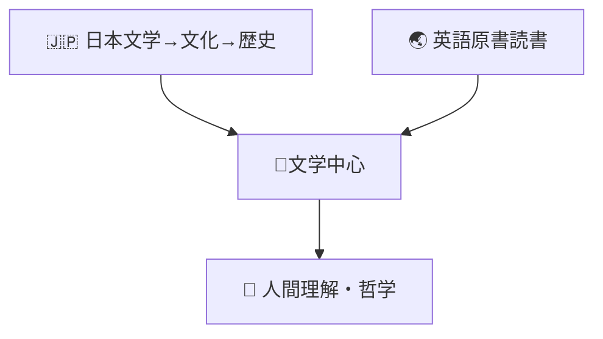

# 📚 Reading Database
### 2026/06 as now

| Year | Status | Title | Author | Progress |
|------|---------|---------|---------|---------|
| 2025 | Done | 菜食主義者 | ハンカン（韓江） | 100% |
| 2025 | Done | 国境の南、太陽の西 | 村上春樹 | 100% |
| 2025 | Done | 天国旅行 | 三浦しおん | 100% |
| 2025 | Done | 神去のなあなあ日常 | 三浦しおん | 100% |
| 2025 | Done | 光 | 三浦しおん | 100% |
| 2025 | Done | Japan's Cultural Codewords | De Mente | 100% |
| 2025 | Done | Understanding Cultural Treasures of Japan | Motoko Yamamoto | 100% |
| 2025 | On-going | The Vegetarian | Han Kang | 20% |
| 2025 | On-going | 風が強く吹いている | 三浦しおん | 15% |
| 2025 | Dropped | 日本語の歌と詩 | - | 1% |
| 2025 | Dropped | One Hundred Poems from Old Japan（百人一首 訳） | Michael Freiling | 1% |
| 2025 | Dropped | エモい古語辞典 | - | 1% |
| 2026 | Done | 星の王子さま | 河野万里子訳 | 100% |
| 2026 | Done | 超かぐや姫 | スタジオコロリド、スタジオクロマト | 100% |
| 2026 | Done | キッチン | 吉本ばなな | 100% |
| 2026 | Done | Never Let Me Go | Kazuo Ishiguro | 100% |
| 2026 | On-going | 君の名前は | 新海誠 | 5% |
| 2026 | On-going | ツナグ | 辻村深月 | 5% |
| 2026 | On-going | コンビニ人間 | 村田沙耶香 | 25% |
| 2026 | On-going | Holes | Louis Sachar | 55% |
| 2026 | On-going | A History of Modern Japan | Christopher Harding | 30% |
| 2026 | Planned | 博士の愛した数式 | 小川洋子 | 0% |
| 2026 | Planned | ひばな | 又吉直樹 | 0% |
| 2026 | Planned | 夜は短し歩けよ乙女 | 森見登美彦 | 0% |
| 2026 | Planned | 坊っちゃん | 夏目漱石 | 0% |
| 2026 | Planned | 死神の精度 | 伊坂幸太郎 | 0% |
| 2026 | Planned | The Amazon Way | Amazon | 0% |
| 2026 | Planned | Wonder | R.J. Palacio | 0% |
| 2026 | Planned | The Giver | Lois Lowry | 0% |
| 2026 | Planned | Why Nations Fail | Daron Acemoglu, James Robinson | 0% |
| 2026 | Planned | The Human Condition | Hannah Arendt | 5% |

---

# 📚 読書分析レポート（2025–2026）

## 読書進捗

| 区分 | 冊数 | グラフ |
|------|------|------|
| 2025年読了 | 7 | ███████ |
| 2025年読書中 | 2 | ██ |
| 2025年中断 | 2 | ██ |
| 2026年読了 | 4 | ████ |
| 2026年読書中 | 5 | █████ |
| 読書予定 | 9 | █████████ |

---

## 状態別集計

| 状態 | 冊数 | グラフ |
|------|------|------|
| 読了 | 11 | ███████████ |
| 読書中 | 7 | ███████ |
| 予定 | 9 | █████████ |
| 中断 | 2 | ██ |

---

## 言語別分析

| 言語 | 冊数 | グラフ |
|------|------|------|
| 日本語 | 21 | █████████████████████ |
| 英語 | 8 | ████████ |

---

## ジャンル別分析

| ジャンル | 冊数 | グラフ |
|----------|------|------|
| 文学・小説 | 21 | █████████████████████ |
| 日本文化 | 2 | ██ |
| 日本史 | 1 | █ |
| ビジネス | 1 | █ |
| 社会・政治・哲学 | 2 | ██ |
| ~~古典・和歌~~ | ~~2~~ | ██ |

---

## 傾向分析

| テーマ | 強度 |
|---------|------|
| 人間関係 | ██████████ |
| アイデンティティ・自己発見 | █████████ |
| 孤独・成長・生と死 | ████████ |
| 日本文化理解 | ██████ |
| 社会・歴史理解 | ████ |

---

## 総評
## 読書傾向マップ

### 読書スタイル

- 日本文学を中心に読書
- 英語原書にも継続的に挑戦
- 日本文化・歴史への関心が高い
- 近年は文学から社会・歴史・思想分野へと読書範囲を拡大中
<!--- 「孤独」「喪失」「成長」「生と死」を扱う作品を好む -->

### 一言で表すと
あなたの読書は単なる娯楽ではなく、**文学を通じて人間を理解し、日本文化を理解し、さらに社会や歴史へ視野を広げていく**読書傾向が見られる。
