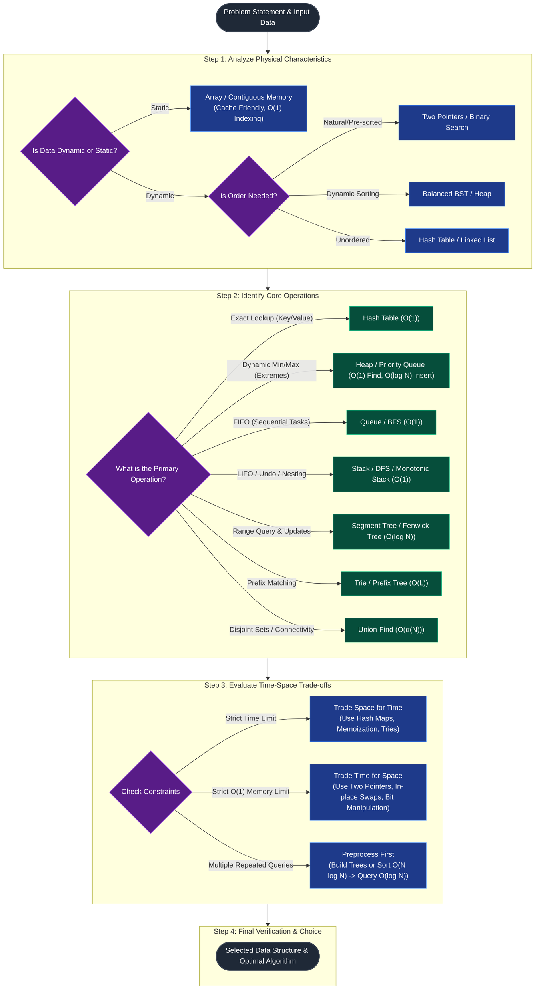

## think model

## complexity of data structure
| Category | Data Structure | Access / Query (Avg) | Search / Find (Avg) | Insert / Add (Avg) | Delete / Remove (Avg) | Access / Query (Worst) | Search / Find (Worst) | Insert / Add (Worst) | Delete / Remove (Worst) | Space Complexity (Worst) |
| :--- | :--- | :--- | :--- | :--- | :--- | :--- | :--- | :--- | :--- | :--- |
| **Linear** | **Array** | $O(1)$ | $O(n)$ | $O(n)$ | $O(n)$ | $O(1)$ | $O(n)$ | $O(n)$ | $O(n)$ | $O(n)$ |
| **Linear** | **Sorted Array** | $O(1)$ | $O(\log n)$ | $O(n)$ | $O(n)$ | $O(1)$ | $O(\log n)$ | $O(n)$ | $O(n)$ | $O(n)$ |
| **Linear** | **Dynamic Array** | $O(1)$ | $O(n)$ | $O(1)$ *(Amortized)* | $O(n)$ | $O(1)$ | $O(n)$ | $O(n)$ *(Realloc)* | $O(n)$ | $O(n)$ |
| **Linear** | **Singly-Linked List** | $O(n)$ | $O(n)$ | $O(1)$ | $O(1)$ | $O(n)$ | $O(n)$ | $O(1)$ | $O(1)$ | $O(n)$ |
| **Linear** | **Doubly-Linked List** | $O(n)$ | $O(n)$ | $O(1)$ | $O(1)$ | $O(n)$ | $O(n)$ | $O(1)$ | $O(1)$ | $O(n)$ |
| **Linear** | **Stack** | $O(n)$ | $O(n)$ | $O(1)$ | $O(1)$ | $O(n)$ | $O(n)$ | $O(1)$ | $O(1)$ | $O(n)$ |
| **Linear** | **Queue / Deque** | $O(n)$ | $O(n)$ | $O(1)$ | $O(1)$ | $O(n)$ | $O(n)$ | $O(1)$ | $O(1)$ | $O(n)$ |
| **Linear** | **Skip List** | $O(\log n)$ | $O(\log n)$ | $O(\log n)$ | $O(\log n)$ | $O(n)$ | $O(n)$ | $O(n)$ | $O(n)$ | $O(n \log n)$ |
| **Hash-Based** | **Hash Table / Map** | — | $O(1)$ | $O(1)$ | $O(1)$ | — | $O(n)$ | $O(n)$ | $O(n)$ | $O(n)$ |
| **Hash-Based** | **Hash Set** | — | $O(1)$ | $O(1)$ | $O(1)$ | — | $O(n)$ | $O(n)$ | $O(n)$ | $O(n)$ |
| **Hash-Based** | **Bloom Filter** | — | $O(k)$ | $O(k)$ | N/A | — | $O(k)$ | $O(k)$ | N/A | $O(m)$ |
| **Tree-Based** | **Binary Search Tree** | — | $O(\log n)$ | $O(\log n)$ | $O(\log n)$ | — | $O(n)$ | $O(n)$ | $O(n)$ | $O(n)$ |
| **Tree-Based** | **AVL Tree** | — | $O(\log n)$ | $O(\log n)$ | $O(\log n)$ | — | $O(\log n)$ | $O(\log n)$ | $O(\log n)$ | $O(n)$ |
| **Tree-Based** | **Red-Black Tree** | — | $O(\log n)$ | $O(\log n)$ | $O(\log n)$ | — | $O(\log n)$ | $O(\log n)$ | $O(\log n)$ | $O(n)$ |
| **Tree-Based** | **B-Tree / B+ Tree** | — | $O(\log n)$ | $O(\log n)$ | $O(\log n)$ | — | $O(\log n)$ | $O(\log n)$ | $O(\log n)$ | $O(n)$ |
| **Tree-Based** | **Splay Tree** | — | $O(\log n)$ *(Amortized)* | $O(\log n)$ *(Amortized)* | $O(\log n)$ *(Amortized)* | — | $O(n)$ | $O(n)$ | $O(n)$ | $O(n)$ |
| **Tree-Based** | **Segment Tree** | $O(\log n)$ | — | $O(\log n)$ | $O(\log n)$ | $O(\log n)$ | — | $O(\log n)$ | $O(\log n)$ | $O(n)$ |
| **Tree-Based** | **Fenwick Tree (BIT)** | $O(\log n)$ | — | $O(\log n)$ | N/A | $O(\log n)$ | — | $O(\log n)$ | N/A | $O(n)$ |
| **Tree-Based** | **Trie (Prefix Tree)** | — | $O(L)$ | $O(L)$ | $O(L)$ | — | $O(L)$ | $O(L)$ | $O(L)$ | $O(N \cdot L)$ |
| **Heap** | **Binary Heap** | — | $O(1)$ *(Find Min/Max)* | $O(\log n)$ | $O(\log n)$ *(Delete Min/Max)* | — | $O(1)$ *(Find Min/Max)* | $O(\log n)$ | $O(\log n)$ *(Delete Min/Max)* | $O(n)$ |
| **Heap** | **Binomial Heap** | — | $O(1)$ *(Find Min/Max)* | $O(1)$ *(Amortized)* | $O(\log n)$ *(Delete Min/Max)* | — | $O(1)$ *(Find Min/Max)* | $O(\log n)$ | $O(\log n)$ *(Delete Min/Max)* | $O(n)$ |
| **Heap** | **Fibonacci Heap** | — | $O(1)$ *(Find Min/Max)* | $O(1)$ | $O(\log n)$ *(Amortized)* | — | $O(1)$ *(Find Min/Max)* | $O(1)$ | $O(\log n)$ *(Amortized)* | $O(n)$ |
| **Graph & Special** | **Adjacency Matrix** | $O(1)$ *(Edge lookup)* | $O(V^2)$ *(Traversal)* | $O(1)$ *(Add edge)* | $O(1)$ *(Remove edge)* | $O(1)$ *(Edge lookup)* | $O(V^2)$ *(Traversal)* | $O(1)$ *(Add edge)* | $O(1)$ *(Remove edge)* | $O(V^2)$ |
| **Graph & Special** | **Adjacency List** | $O(\text{deg}(V))$ | $O(V + E)$ *(Traversal)* | $O(1)$ *(Add edge)* | $O(\text{deg}(V))$ | $O(\text{deg}(V))$ | $O(V + E)$ *(Traversal)* | $O(1)$ *(Add edge)* | $O(\text{deg}(V))$ | $O(V + E)$ |
| **Graph & Special** | **Union-Find (DSU)** | — | $O(\alpha(N))$ *(Find)* | $O(\alpha(N))$ *(Union)* | N/A | — | $O(\alpha(N))$ *(Find)* | $O(\alpha(N))$ *(Union)* | N/A | $O(N)$ |
| **Graph & Special** | **Suffix Tree** | — | $O(M)$ *(Pattern match)* | $O(N)$ *(Build)* | N/A | — | $O(M)$ *(Pattern match)* | $O(N)$ *(Build)* | N/A | $O(N)$ |

Variable Glossary
- $n / N$: Number of elements / items in the data structure.
- $V$: Number of vertices in a graph.
- $E$: Number of edges in a graph.
- $L$: Length of a string key.
- $M$: Length of a search pattern string.
- $k$: Number of hash functions (Bloom Filter).
- $m$: Size of the bit array (Bloom Filter).
- $\alpha(N)$: Inverse Ackermann function (effectively $O(1)$ in practice).
