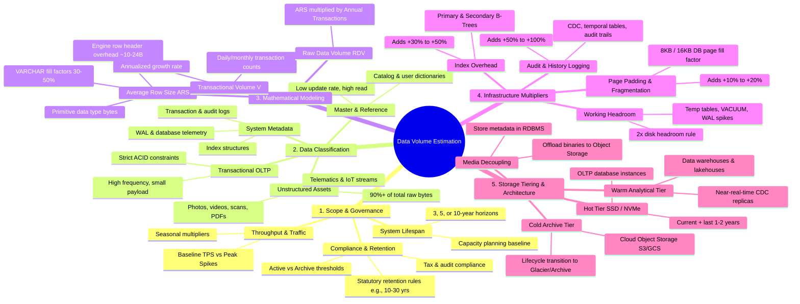

# 🧠 Mind Map: Structured Data Volume Estimation Methodology



---

## 🌳 Detailed Hierarchical Tree (Text View)

```text
Data Volume Estimation Methodology
│
├── 🎯 1. Scope, Boundary & Governance
│   ├── 📅 Sizing Horizon
│   │   ├── 3-Year Operational Plan
│   │   └── 5 to 10-Year Enterprise Architecture Lifecycle
│   ├── ⚖️ Statutory Retention & Legal Mandates
│   │   ├── Electronic Bookkeeping Act / Tax laws (7–10 years)
│   │   └── Insurance / Financial Contracts (10–30 years / Permanent)
│   └── 📈 Traffic Profile
│       ├── Average Transactions per Second (TPS)
│       └── Peak Season Multipliers (Catastrophes, Year-End batches)
│
├── 🗂️ 2. Data Categorization & Characteristics
│   ├── ⚡ Transactional Data (OLTP / ACID)
│   │   └── Orders, policy endorsements, claims processing steps
│   ├── 📖 Master / Reference Data
│   │   └── User profiles, product rate charts, agency hierarchy
│   ├── 📦 Unstructured Media (Blobs)
│   │   ├── Scanned application forms, damage photos, dashcam video
│   │   └── Telematics / IoT streaming breadcrumbs
│   └── ⚙️ Engine Metadata
│       └── WAL logs, crash recovery buffers, index trees
│
├── 📐 3. Mathematical Sizing Formula
│   ├── 🔍 Step A: Calculate Average Row Size (ARS)
│   │   ├── Primitive column types (INT=4B, BIGINT=8B, TIMESTAMP=8B)
│   │   ├── Variable character length estimate (VARCHAR avg length)
│   │   └── Engine-level row header overhead (~10–24 bytes)
│   ├── 📊 Step B: Project Transactional Velocity (V)
│   │   └── Annual Transactions = Daily Transactions × 365
│   └── 🧮 Step C: Compute Raw Data Volume (RDV)
│       └── RDV = ARS × V
│
├── 🚀 4. Real-World Multipliers (The "Hidden" Storage)
│   ├── 📑 Index Multiplier (+30% to +50%)
│   │   └── Primary keys, Foreign keys, composite B-Trees, GiST/GIN
│   ├── 🧱 Page Padding / Fragmentation (+10% to +20%)
│   │   └── Fill-factor thresholds (default 80-90% to allow in-page updates)
│   ├── 📝 Audit & Regulatory Logging (+50% to +100%)
│   │   └── Change Data Capture (CDC), history tables, soft-delete copies
│   └── 🛡️ Disk Safety Headroom (2x Buffer Rule)
│       └── Temporary disk sorts, index rebuilds, autovacuum expansion
│
└── 🏛️ 5. Storage Tiering & Architecture Strategy
    ├── 🔥 Hot Tier (Fast NVMe SSD)
    │   ├── Scope: Active operational working set (current + 1-2 years)
    │   └── Typical Size: Under 5–10 TB for most enterprise cores
    ├── 🌤️ Warm Tier (Enterprise DWH / Lakehouse)
    │   ├── Scope: Analytical queries, business intelligence, actuarial runs
    │   └── Engines: BigQuery, Snowflake, Amazon Redshift
    ├── 🧊 Cold Archive Tier (Object Storage)
    │   ├── Scope: Compliance records, static archives (10+ years)
    │   └── Engines: S3 Glacier Deep Archive, GCS Archive
    └── ✂️ Media Decoupling Pattern
        ├── Rule: NEVER store binary BLOBs inside core RDBMS
        └── Design: Store URI strings in database; store files in Object Storage
```

---

## ⚡ Quick Reference Formula Summary

| Component | Mathematical Formula / Estimation Rule |
| :--- | :--- |
| **Average Row Size ($ARS$)** | $\sum (\text{Primitive Data Types}) + \text{Avg}(\text{VARCHARs}) + \text{Row Header (10B–24B)}$ |
| **Annual Raw Volume ($RDV$)** | $ARS \times \text{Annual Transaction Count}$ |
| **Physical Table Footprint** | $RDV \times (1 + \text{Page Overhead: } 0.15)$ |
| **Index Footprint** | $RDV \times (\text{Index Overhead: } 0.30 \text{ to } 0.50)$ |
| **Audit Log Footprint** | $RDV \times (\text{Audit Factor: } 0.50 \text{ to } 1.00)$ |
| **Total Annual DB Storage ($S_{annual}$)** | $\text{Physical Table} + \text{Index Footprint} + \text{Audit Footprint} \approx RDV \times (2.0 \text{ to } 2.7)$ |
| **System Disk Provisioning Target** | $S_{annual} \times \text{Lifespan Years} \times 2.0\text{ (Safety Headroom)}$ |
